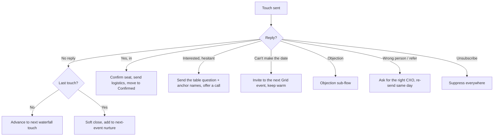
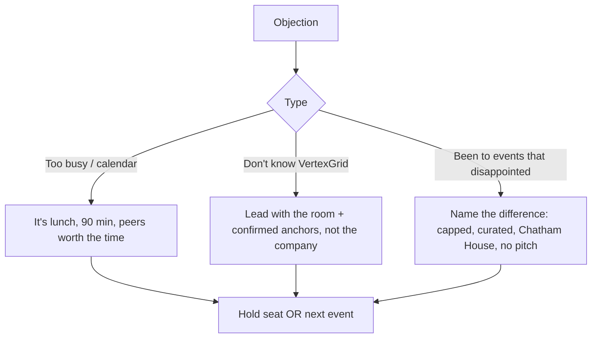

# VertexGrid Lead-Gen Playbook (Master)

> Hand this to a lead-gen rep and they can run the VertexGrid campaign without asking a single follow-up question. It covers who to chase, what to send, on which channel, in what order, and exactly what to do when someone replies. Grounded in the real Bangalore data we delivered, not invented profiles.

---

## 0. TL;DR (read this first)

**Win condition:** for the Jun 25 curated CXO lunch, **12-18 confirmed senior technology leaders** in the room, with anchors locked before any general invite. Longer game: a repeatable CXO-community engine for VertexGrid.

**The one strategic choice that decides everything:** lead with the prospect's infrastructure problem, never with VertexGrid's pitch. CXOs receive dozens of invites; they accept the ones that name the conversation they are already having.

**The lesson baked into this whole playbook:** the May 14 forum collapsed from 16 RSVPs to ~4 in the room because unconfirmed anchor names (Razorpay, Lenskart, Meesho, Swiggy, Siemens) were used as social proof and did not hold. **Only cite genuinely confirmed names.** The real, defensible anchors are Ashish Tarte (Reliance Jio CTO, confirmed and attended), plus the AMEX and IKEA representatives.

**First move Monday:** pull the R1 Tech-Infra Core tab, hand Tier 1 names to named reps, and start the Day-0 email to Persona 1 and 2.

---

## 1. The offer and the proof

**What VertexGrid is:** a Bangalore technology-infrastructure company. "The Grid" is its invite-only CXO community, positioned as a peer convening, not a sales event, Chatham House rule throughout.

**Buyer outcome:** for enterprise infra leaders, a peer room to pressure-test the cost, latency, sovereignty, and reliability calls behind production AI, and a partner who has run infrastructure at their scale. For founders, a peer table and infrastructure that scales with them.

**Confirmed proof (use only these as anchors):**
| Anchor | Status |
|--------|--------|
| Ashish Tarte, CTO, Reliance Jio | Confirmed AND attended May 14. Available as named reference. |
| AMEX representative | Attended, named testimonial source. |
| IKEA representative | Attended, named testimonial source. |

**Do not reuse as confirmed:** Razorpay / Lenskart / Meesho / Swiggy / Siemens. These were aspirational on May 14 and the cascade is what sank the event.

**Pricing posture:** the lunch is a hosted community initiative, not a paid ticket. No price in outreach. Any commercial infra conversation is a post-event one-on-one, scoped, and Sreedeep signs off on numbers.

---

## 2. Personas (who we chase)

The Bangalore set is two motions. Lead the lunch with Motion A; use Motion B for energy and volume. Full detail in [[VertexGrid-Personas-and-Pitches]].

| # | Persona | Motion | Real accounts in the data | Priority | Pull from |
|---|---------|--------|---------------------------|----------|-----------|
| 1 | Enterprise Infrastructure Owner | A | Jio Platforms, Honeywell, Microland, Toshiba Software | P0 bullseye | R1 Tech-Infra Core |
| 2 | Regulated Tech & Security Leader | A | Jana Small Finance Bank, Perfios, CRED, Ujjivan | P0 | R1 Tech-Infra Core |
| 3 | Industrial / Electronics Mfg Tech Head | A | Honeywell, CG Power, Avalon Technologies | P1 | R1 Tech-Infra Core |
| 4 | Scaling Tech Founder-CEO | B | AppsForBharat, AlmaBetter, axcess.io, Avekshaa | P1 volume | 331 Enriched |
| 5 | Diversified Transformation Founder | B | Ati Motors, Altigreen, ace turtle, BHIVE, Apollo AyurVAID | P2 fill | 331 Enriched |

Each persona's "what keeps them up at night" and why-we-chase is in the personas doc. Reps should read it once before sending.

---

## 3. The channel waterfall (cadence)

Same prospect, multiple surfaces, escalating commitment. CXO calendars demand a 6-8 week runway normally; for the compressed Jun 25 lunch the cadence below is the accelerated, anchor-led version. Outside the lunch, run the full-length version.

### Tier 1 (named CXOs, rep-owned, Persona 1-3), accelerated for Jun 25
| # | Day | Channel | Round | What goes out |
|---|-----|---------|-------|---------------|
| 1 | 0 | Email | R1 | Infra-problem opener naming a confirmed anchor. CTA: hold a seat. |
| 2 | 1 | WhatsApp (if warm) | R1 | One warm line referencing the email. Highest response channel. |
| 3 | 2 | LinkedIn connect + note | R1 | Connection note, no pitch. |
| 4 | 3 | Phone | R2 | Warm call, voicemail script ready. |
| 5 | 5 | Email | R2 | "Holding your seat" + the table question. |
| 6 | 7 | Email/WhatsApp | R3 | Logistics confirm OR final nudge. |

### Tier 2 (Persona 4-5 founders, sequenced)
| # | Day | Channel | Round |
|---|-----|---------|-------|
| 1 | 0 | Email | R1 |
| 2 | 3 | LinkedIn connect | R1 |
| 3 | 6 | Email | R2 |
| 4 | 10 | Email | R3 + nudge |

### Daily quota per rep
Email 50, WhatsApp (warm only) 15, LinkedIn connects 20, dials 8 (Tier 1 only). Stop the sequence the moment a prospect engages and switch to the reply flow (section 5).

---

## 4. Exact pitches (personalize line 1, send the rest)

### Persona 1: Enterprise Infrastructure Owner

**Email R1**, Subject: `How {{company}} runs infra at scale, June 25 table`
```
{{first_name}}, [one personal line: a recent move their team made].

I'm pulling together a closed table of the people who actually run
production infrastructure at Bangalore's largest firms. Not the keynote
version, the real cost-latency-reliability calls behind running AI in
production.

{{anchor_1}} is in. Twelve to fourteen peers, Chatham House, no deck,
no pitch. Thursday June 25, lunch at the Conrad.

Can I hold a seat for you?

{{rep_first}}, VertexGrid
```

**WhatsApp R1 (warm only)**
```
Hi {{first_name}}, {{rep_first}} from VertexGrid. Closed CXO lunch on
production-AI infrastructure, Jun 25 at the Conrad, {{anchor_1}} is in.
Fourteen peers, Chatham House. Want me to hold you a seat?
```

**Phone R2 (Tier 1)**
```
{{first_name}}, {{rep_first}} from VertexGrid, won't keep you. We're
hosting a closed table of infra leaders on June 25, {{anchor_1}} is in.
Wanted you at it. Sending the details now. Worth a look?

Voicemail: Hi {{first_name}}, {{rep_first}} from VertexGrid re a closed
CXO infrastructure lunch June 25, Conrad. Sending details now. Hope
you can join.
```

### Persona 2: Regulated Tech & Security Leader

**Email R1**, Subject: `The infra decisions that survive an RBI audit, June 25`
```
{{first_name}}, your peers in banking and fintech are all wrestling the
same thing: residency, resilience, and the real cost of compliance done
right.

I'm hosting a closed lunch for technology leaders on exactly that, June
25 at the Conrad. {{anchor_AMEX}} representation in the room. Chatham
House, no pitch.

Can I hold you a seat?

{{rep_first}}, VertexGrid
```

### Persona 3: Industrial / Electronics Mfg Tech Head

**Email R1**, Subject: `Plant floor meets data centre, a June 25 table`
```
{{first_name}}, the hardest infra call in manufacturing right now is
bringing OT and IT into one architecture without breaking either.

I'm convening a closed lunch of industrial technology leaders on June
25, Conrad, to compare notes. {{anchor_IKEA}} representation in the
room. No deck, Chatham House.

Worth a seat?

{{rep_first}}, VertexGrid
```

### Persona 4: Scaling Tech Founder-CEO

**Email R1**, Subject: `A founder table for the next infra-heavy companies`
```
{{first_name}}, the founders scaling Bangalore's infra-heavy companies
keep hitting the same walls: cost that scales faster than revenue,
reliability under growth, build vs buy.

Putting a small founder table together on exactly that. Peers a stage
ahead. {{date/format}}.

Want in?

{{rep_first}}, VertexGrid
```

**LinkedIn connect note (any persona)**
```
{{first_name}}, sent you a note on a closed infrastructure table we're
hosting June 25. Connecting because your team will be in this
conversation regardless. Open to a quick chat if useful.
```

### Persona 5: Diversified Transformation Founder

**Email R1**, Subject: `The digital backbone conversation for {{industry}}`
```
{{first_name}}, modernizing when tech isn't your core business is its
own kind of hard. I'm bringing a few operators from outside pure tech
into a closed table of technology leaders, June 25, so the room hears
the real-world transformation view.

Your seat would be the {{industry}} perspective everyone wants. In?

{{rep_first}}, VertexGrid
```

---

## 5. Decision flowcharts (reply handling)

### Master reply flow (all channels)


| Reply signal | SLA | Action | Script seed |
|--------------|-----|--------|-------------|
| "I'm in" | 30 min | Confirm seat, send logistics email + the table question | "Brilliant. Holding your seat. Quick logistics below, and one question I'll ask the table." |
| "Maybe / tell me who else" | 2h | Send confirmed anchors only + the agenda, offer a 10-min call | "Of course. {{anchor_1}} and {{anchor_AMEX}} are in. Here's the shape of the table. 10 mins to walk you through it?" |
| "Can't make June 25" | 24h | Invite to the next Grid event, keep relationship warm | "No problem at all. I'll save you a seat at the next one. Mind if I keep you on the inside track?" |
| "What's this really about / are you selling me?" | 2h | Reassure: community, no pitch, Chatham House | "Genuinely no pitch. Two host seats max, no deck, Chatham House. The value is the room." |
| "Wrong person" | 2h | Ask who owns infra, re-send same day | "Appreciate it, who owns infrastructure on your side? Happy to invite them directly." |

### Objection sub-flow


| Objection | Reframe |
|-----------|---------|
| "Too busy" | "It's a 90-minute lunch with peers you'd want to know anyway. That's usually the easiest yes on a busy calendar." |
| "I don't know VertexGrid" | "Fair. Honestly the draw is the room, not us. {{anchor_1}} and {{anchor_AMEX}} are in, and it's Chatham House." |
| "Events usually disappoint" | "That's exactly why this is capped at 14, curated, no vendor pitches, and Chatham House. Different format on purpose." |

---

## 6. The operating system

### Real-time tracker (single source of truth, updated within the hour)
| Field | Use |
|-------|-----|
| Name / Title / Company | the seat |
| Persona (1-5) + Tier | sourcing priority |
| Status: Invited / Confirmed / Declined / Tentative | the live count |
| Channel + last touch date | cadence discipline |
| Owner | who chases |
| Dietary / notes | logistics |

A live count cell at top: confirmed vs the 12 floor / 18 cap. Reviewed at both gates.

### Gates (where a cascade could happen)
| Gate | Date | Rule |
|------|------|------|
| Anchors locked | **Fri Jun 13** | ≥ 2 confirmed anchors before any general invite. If not, slip to early July. |
| Headcount check | **Fri Jun 19** | ≥ 10 confirmed. If short, anchors each bring a peer; extend list; consider slip. |

### Reply SLAs
"I'm in" 30 min. Interested 2h. Sample/info 4h. Wrong person 2h. Unsubscribe immediate.

### Hard don'ts
1. Never cite an unconfirmed name as a confirmed anchor. This is the cardinal rule after May 14.
2. Never send a general invite before anchors are locked.
3. Never put more than two VertexGrid people at the table (it reads as a sales trap).
4. Never pitch product in the room; the sale is the follow-up.
5. Never cold-WhatsApp a stranger; warm contacts only.
6. Never mail unverified or info@/hello@ addresses; never re-mail bounces.
7. Never quote firm commercial numbers without Sreedeep's sign-off.

---

## 7. Weekly review cadence

Through the lunch, a Monday check on: confirmed count vs floor/cap, anchor status, reply rate by persona, channel performance (WhatsApp should outperform email by a wide margin on warm contacts). Iteration rules: if confirms lag by Wednesday, escalate anchor peer-intros and widen the Tier 1 list; if a persona is silent, switch its R1 hook.

---

## 8. Files / related
[[VertexGrid-Personas-and-Pitches]] · [[VertexGrid CXO Lunch Rollout Plan]] · `Atlas/Clients/VertexGrid/Bengaluru_Data_QA_Segmented.xlsx` · `Efforts/Active/VertexGrid-332-Enriched.xlsx` · [[VertexGrid]] · [[lead-gen-playbook-builder]]
