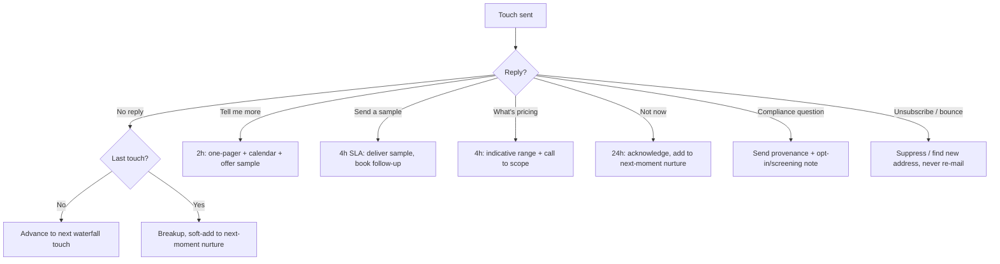
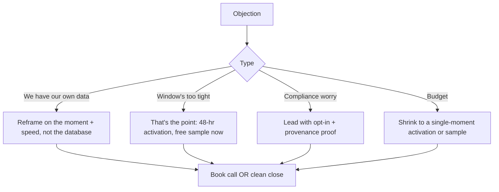

# B2C Moment Campaigns Lead-Gen Playbook (Master)

> The consumer-audience track, made rep-executable. We sell moment-timed consumer-audience data and campaign-as-a-service packages to the brands and buyers whose customers spend during cultural moments. The lead-gen target is the BUYER (the brand's growth lead, the agency, the insurer), and the product is speed: live consumer audiences segmented to the moment, activatable in 48 hours. Distinct from the B2B agency outreach in [[WorldCup-LeadGen-Playbook]]; this one is buyer-direct across all four moments.

---

## 0. TL;DR (read this first)

**Win condition:** for each moment, qualified buyer conversations and licensed audience deals before the moment's window closes. World Cup is the only one with a 72-hour clock; treat the rest on a calmer runway.

**The one strategic choice:** sell the buyer's spike, not "data." The pitch is "your customers are about to get busy for {{window}}; here is exactly who, ready to activate in 48 hours," never "we have a database."

**The moment spine (sequenced so each hands off to the next):**
| Moment | Buyer trigger | Window | Ship-by |
|--------|--------------|--------|---------|
| World Cup | 39 days of fan spend, 11 US host metros | Jun 11 - Jul 19 | **In-flight now (72-hr sprint)** |
| July 4 (Saturday) | Retail / BBQ / travel / auto spike | Jun 24 - Jul 6 | Creative live ~Jun 24 |
| Back-to-school | Parents buying K-12 + college | Jul 15 - Sep 5 | Build starts Jul 7 |
| Pet insurance | Evergreen pet-owner demand | Rolling | First non-moment, after BTS |

**First move:** confirm the host-metro consumer segment pull with the data team, then push the World Cup buyer offer to retail, QSR, travel, and OTT growth leads today.

---

## 1. The offer and the proof

**What we sell:** moment-segmented consumer-audience data and campaign-as-a-service bundles. The buyer licenses a live, opt-in-screened audience mapped to the moment and their vertical, activatable in 48 hours.

**Buyer outcome:** reach the consumers who are about to spend, in their city, before the window closes, without building the audience themselves.

**Proof to use:** the Megaverse AI-enablement sample pattern that converted (a small, real, free sample audience as the lead magnet), data freshness, and host-metro depth (11 of 16 World Cup host cities are US, where Lake B2B data is strongest). Indicative pricing only in outreach; firm pricing on scope with Sreedeep sign-off.

**Pricing posture:** never quote in R1/R2. R3 carries indicative bundle ranges only.

---

## 2. Personas (who we chase, the buyers)

| # | Persona | Activates on | What keeps them up at night | Priority |
|---|---------|-------------|------------------------------|----------|
| 1 | Retail / Ecommerce Growth Lead (VP Growth, CMO, Head of Performance) | World Cup merch, July 4 deals, back-to-school apparel | Hitting the moment before competitors, finding the right audience fast | P0 |
| 2 | QSR / F&B Marketing Lead (franchise/regional marketing director) | World Cup diners, July 4 BBQ | Foot traffic + delivery spikes, local activation at speed | P1 |
| 3 | Travel / Hospitality Marketing Lead (hotel GM, OTA growth) | World Cup host-metro inbound, July 4 road trips | Filling rooms/seats in the window, reaching in-market travelers | P1 |
| 4 | Insurance Acquisition Lead (Head of CAC/Growth at insurers) | Pet insurance (evergreen) | Cost-efficient, high-intent acquisition; uninsured pet owners | P1 |
| 5 | Agency / Performance Partner (buys wholesale to serve clients) | All moments | Turnkey moment audiences to resell to their roster | P2 (cross-ref agency playbook) |

### Consumer segments we package (what the buyer is actually licensing)
| Moment | Top consumer segments |
|--------|----------------------|
| World Cup | Host-metro sports fans, QSR/delivery diners, travel intenders, OTT households, fan-merch shoppers, betting (regulated, screened) |
| July 4 | Grilling/BBQ households, domestic travelers, patriotic/party shoppers, "4th of July sale" deal-seekers, home-improvement |
| Back-to-school | Parents of K-12, parents of college-bound, budget shoppers, edtech intenders, apparel refresh |
| Pet insurance | New-pet households, owners by pet age, breed-risk, vet-adjacent high-spend, uninsured owners |

---

## 3. The channel waterfall (cadence)

Buyer-direct B2B outreach, moment-timed. The hook is always the countdown and the 48-hour activation.

### Tier 1 (named brand/insurer buyers, rep-owned)
| # | Day | Channel | Round | What goes out |
|---|-----|---------|-------|---------------|
| 1 | 0 | Email | R1 | Moment-spike opener for their vertical. CTA: 15 min OR free sample audience. |
| 2 | 2 | LinkedIn connect + note | R1 | Connection note, no pitch. |
| 3 | 4 | LinkedIn DM | R2 | Free vertical-specific sample audience hook. |
| 4 | 5 | Phone | R2 | Warm call, voicemail ready (moment urgency). |
| 5 | 7 | Email | R3 | Bundle options + indicative pricing + 48-hr activation. |
| 6 | 9 | Email | R3 | Breakup, "window's closing" close. |

### Tier 2 (sequenced)
Email R1 (Day 0), LinkedIn connect (Day 4), Email R2 sample (Day 7), Email R3 + breakup (Day 12).

### Sample fulfilment SLA: 4 hours
On a sample request, deliver within 4 hours: a small anonymized slice of the relevant consumer segment + a one-page methodology note. The sample is the pitch; do not add a sell when delivering it.

### Daily quota per rep
Email 50, LinkedIn connects 20, LinkedIn DMs 10, dials 8, sample fulfilments 5. Stop on engagement, switch to the reply flow.

---

## 4. Exact pitches (personalize line 1, send the rest)

### Persona 1: Retail / Ecommerce Growth Lead, World Cup
**Email R1**, Subject: `Your {{category}} shoppers in the next 39 days`
```
{{first_name}}, the global football tournament starts this week and your
{{category}} shoppers across the US host metros are about to get busy for
39 days.

We can hand you a live, opt-in audience of exactly those buyers, by city,
activatable in 48 hours. Worth 15 mins, or want a free sample slice for
one metro first?

{{rep_first}}
Lake B2B | Enabling Growth
```

### Persona 1, July 4
**Email R1**, Subject: `Your July 4 deal-seekers, before the long weekend`
```
{{first_name}}, July 4 lands on a Saturday this year, so the spend
front-loads into the week before. We can put your {{category}} in front
of the grilling households, road-trippers, and "4th of July sale"
shoppers in your markets, live in 48 hours.

15 mins, or a free sample audience first?

{{rep_first}}
Lake B2B | Enabling Growth
```

### Persona 2: QSR / F&B Marketing Lead, World Cup
**Email R1**, Subject: `Match-night diners in your metros, 39 days`
```
{{first_name}}, for the next 39 days, match nights mean order spikes.
We can hand you the diners and delivery customers most likely to order
during the window, segmented to your locations, live in 48 hours.

Want a free sample for one metro, or 15 mins?

{{rep_first}}
Lake B2B | Enabling Growth
```

### Persona 3: Travel / Hospitality Marketing Lead, World Cup
**Email R1**, Subject: `In-market travelers to {{host_metro}} this summer`
```
{{first_name}}, {{host_metro}} is a host city, and inbound demand is about
to spike for five weeks. We can map the in-market travelers and
corporate-hospitality buyers heading your way, activatable in 48 hours.

Free sample for {{host_metro}}, or a quick 15 mins?

{{rep_first}}
Lake B2B | Enabling Growth
```

### Persona 4: Insurance Acquisition Lead, Pet insurance
**Email R1**, Subject: `High-intent uninsured pet owners, by breed and age`
```
{{first_name}}, the cleanest acquisition signal in pet insurance is a new-
pet household or an aging pet with rising vet costs. We can hand you those
high-intent, uninsured owners, segmented by breed risk and pet age, ready
to activate.

Want a free sample slice, or 15 mins to scope it?

{{rep_first}}
Lake B2B | Enabling Growth
```

### Back-to-school (Persona 1, parents only)
**Email R1**, Subject: `Back-to-school parents in your markets`
```
{{first_name}}, back-to-school spend is ramping. We can put your brand in
front of parents of K-12 and college-bound students in your markets,
segmented and opt-in, live in 48 hours.

15 mins, or a free sample audience first?

{{rep_first}}
Lake B2B | Enabling Growth
```
> Compliance: target PARENTS only. Never package or imply data on minors.

### LinkedIn connect note (any persona)
```
{{first_name}}, sent you a note on a {{moment}} audience play for
{{their category}}. Connecting because your team's about to be in this
window regardless of whether we work together. Open to a quick chat.
```

### Phone R2 (Tier 1)
```
{{first_name}}, {{rep_first}} from Lake B2B, won't keep you. The {{moment}}
window's open and your {{category}} buyers are about to spike. Sending a
free sample audience by end of day. Email subject "{{subject}}". Worth 15?

Voicemail: Hi {{first_name}}, {{rep_first}} from Lake B2B re a {{moment}}
audience for your {{category}}. Free sample coming by EOD. Email subject
"{{subject}}". Thanks.
```

### Sample-request R2 email
**Subject:** `A free {{segment}} sample, no strings`
```
{{first_name}}, easiest way to know if this is useful is to look at the
actual audience. Tell me your priority {{segment}} and I'll have a free
sample in your inbox within 4 hours. No pitch, no sequence, no strings.

{{rep_first}}
```

### R3 offer email
**Subject:** `Two ways to activate before {{window}} closes`
```
{{first_name}}, last note. Two ways to run this:

  1. Single-moment activation: license the {{segment}} audience for the
     {{window}} window. Live in 48 hours. Indicative from {{range}}.
  2. Campaign-as-a-service: we run the activation end to end. Indicative
     from {{range}}.

If a fit, we paper this week. If not, I'll close the file and circle back
for {{next moment}}.

{{rep_first}}
```

---

## 5. Decision flowcharts (reply handling)

### Master reply flow


| Reply signal | SLA | Action | Script seed |
|--------------|-----|--------|-------------|
| "Tell me more" | 2h | One-pager + calendar + offer sample | "Happy to. Here's the one-pager and a link to grab 15. Want a free {{segment}} sample first?" |
| "Send a sample" | 4h | Deliver the sample, book follow-up | "On its way. If it looks useful, I'll walk you through activation on a quick call." |
| "What's pricing?" | 4h | Indicative range only, gate firm on scope | "Indicative is {{range}}; firm depends on segment mix + activation channel. 15 mins to scope?" |
| "Not now" | 24h | Acknowledge, add to next-moment nurture, stop | "Totally fair, the window's tight. I'll line up the {{next moment}} play for you instead." |
| "Is this data compliant?" | 2h | Send provenance + opt-in screening note | "Every record is opt-in and consent-screened, provenance on each. Here's the methodology note." |
| Unsubscribe / bounce | immediate/auto | Suppress / find new address | none |

### Objection sub-flow


| Objection | Reframe |
|-----------|---------|
| "We already have our own audience" | "Makes sense. The edge here isn't the database, it's the moment overlay and the 48-hour activation. Want a free sample to compare?" |
| "The window's too tight" | "Exactly why we built it for 48-hour activation. Let me send a free sample today so you can decide fast." |
| "Is it compliant?" | "Opt-in and consent-screened, provenance on every record. Happy to send the methodology before anything else." |
| "No budget this quarter" | "Then start with a single-moment activation, not a program. Or just take the free sample so it's ready when budget frees up." |

---

## 6. The operating system

### Real-time tracker
| Field | Use |
|-------|-----|
| Buyer / Title / Company | the account |
| Persona (1-5) + Moment | targeting |
| Status: New / R1 / R2 Sample / R3 / Stage 2 / Won / Lost | the live pipeline |
| Channel + last touch | cadence |
| Sample requested / shipped | the 4h SLA tracker |
| Owner | who chases |

### Compliance guardrails (do not break)
| Area | Rule |
|------|------|
| Consumer contactability | Opt-in / consent-screened. CAN-SPAM (email), TCPA + CTIA (SMS), suppression honored. |
| State privacy | CCPA / CPRA and equivalents: honor opt-out, provenance on every record. |
| World Cup marks | Talk timing window + host cities only. Never "FIFA"/official name/logos in promo. Keep "FIFA" out of subject lines (ESP filters). |
| Betting / sportsbook | Jurisdiction + opt-in screen before any send. |
| Back-to-school | Parents only. Never minors' data (COPPA). Target the buying adult. |
| Pet insurance | No protected-class targeting; honor opt-out. |

### Hard don'ts
1. Never lead with "data" in R1/R2; lead with the buyer's spike.
2. Never quote firm pricing without sign-off; indicative ranges only.
3. Never break the 4-hour sample SLA; one miss is one lost deal.
4. Never pitch when delivering a sample.
5. Never package or imply minors' data for back-to-school.
6. Never mail unverified addresses or re-mail bounces.

### Gates
| Gate | Trigger | Rule |
|------|---------|------|
| World Cup ship | Now | If the data-team segment pull isn't confirmed in 24h, World Cup becomes a July 4 plan only. Don't half-ship. |
| Moment handoff | Each window closes | Retire the moment, pivot the same machine to the next (July 4 to back-to-school to pet insurance). |

---

## 7. Weekly review cadence

Per active moment, weekly: reply rate by persona, sample requests vs shipped (SLA adherence), conversations booked, deals closed, GMV. Iteration rules: if reply rate lags by mid-week, rotate the moment hook and subject; if sample requests lag, tighten the "free, 48-hour, no strings" framing; if conversations lag after samples ship, add a "did you load it" check-in.

---

## 8. Files / related
[[B2C Moment Campaign Rollout Plan]] · [[FIFA-WorldCup-Data-Campaign-Memo]] · [[WorldCup-LeadGen-Playbook]] · [[Email Outreach Engine]] · [[Lake B2B]] · [[lead-gen-playbook-builder]]
