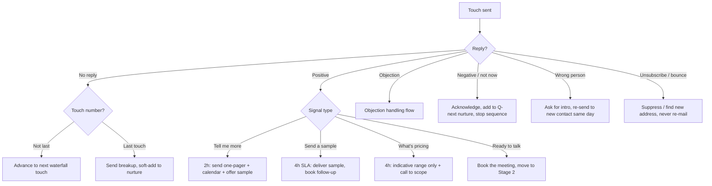
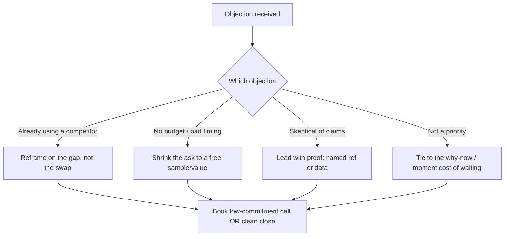
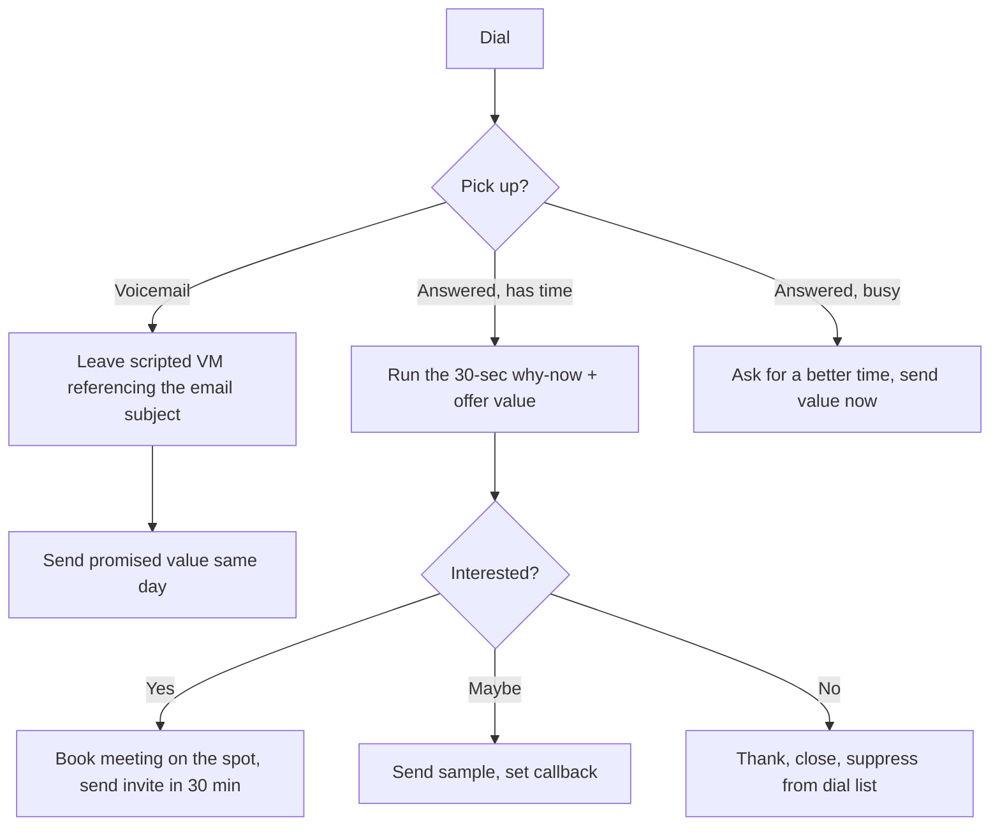

# Decision Flowcharts: reply handling per channel

This is the part reps most often lack. A prospect replies "what's pricing?" and the rep improvises, stalls, or quotes a firm number they shouldn't. The flowchart removes the improvisation: every realistic reply signal maps to a next action, an SLA, and an exact script.

Render flowcharts in Mermaid so they display in Obsidian and most markdown viewers. Build one per channel where reply patterns differ (email and phone diverge most). Keep the node labels short; put the actual scripts in a table beneath each chart.

## Pattern: the master reply-handling flow

## Pattern: per-signal action table (pair with every chart)

| Reply signal | SLA | Action | Script seed |
|--------------|-----|--------|-------------|
| "Tell me more" | 2h | One-pager + calendar link + offer sample | "Happy to. Here's a one-pager and a link to grab 15 mins. Want a {{sample}} first?" |
| "Send a sample" | 4h | Deliver the sample, book a follow-up | "On its way. If it's useful, I'll walk you through {{the logic}} on a quick call." |
| "What's pricing?" | 4h | Indicative range only, gate firm price on scope | "Ballpark is {{range}}; the firm number depends on {{scope variables}}. 15 mins to scope it?" |
| "Not now" | 24h | Acknowledge, add to next-quarter nurture, stop | "Totally fair. I'll check back after {{moment}}. Anything useful in the meantime?" |
| "Wrong person" | 2h | Ask for the intro, re-send to the right contact same day | "Appreciate it, who owns {{area}}? Happy to loop them in." |
| Objection | 2h | Branch to objection-handling flow | See objection table |
| Unsubscribe | immediate | Suppress everywhere | none |
| Bounce | automated | Find a new verified address, never re-mail the bounce | none |

## Pattern: objection-handling sub-flow

| Objection | Surface response | Reframe | Walk-away |
|-----------|------------------|---------|-----------|
| "We already use {{competitor}}" | "Makes sense, most {{persona}} do." | "The gap most teams hit with {{competitor}} is {{specific gap}}. Worth 15 mins on just that?" | "No worries, I'll send one thing that helps regardless." |
| "No budget / bad timing" | "Understood." | "Then let's not talk budget. Want the free {{sample/value}} so it's on your radar for {{next window}}?" | Add to nurture, stop sequence. |
| "How do I know this works?" | "Fair question." | "{{Named reference}} in {{their vertical}} saw {{result}}. Want me to connect you, or send the data?" | Send proof, no push. |
| "Not a priority right now" | "Hear you." | "The reason I flagged it now is {{why-now}}. Waiting past {{date}} usually means {{cost}}." | "I'll circle back after {{moment}}." |

## Pattern: phone-specific flow (diverges from email)

## Rules for building flowcharts into a playbook
- One chart per channel where the reply pattern differs; reuse the master flow where it doesn't.
- Every leaf node resolves to an action with an SLA and a script seed. No dead ends.
- Stage names in the flow must match the tracker's stage names exactly, so a rep moving a card always knows which node they're on.
- Keep firm-pricing nodes gated on sign-off; indicative ranges are pre-approved.
